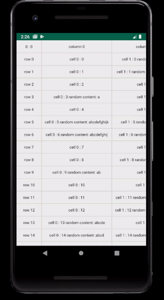

# GBKXYRecycler

Two-way Recycler to display tables or arbitrary custom views.



## Installation
Add to the top level gradle file:
```
allprojects {
    repositories {
        ...
        maven { url 'https://jitpack.io' }
    }
}
```

Add to the app level gradle:
```
dependencies {
    implementation 'com.github.gbksoft:GBKXYRecycler:v1.0.0'
}
```

## Capabilities

- Auto-width columns on-the-fly
- You can use custom layouts as cells
- You can setup width and heights of headers, show or not to show dividers, change dividers colors 


## How to use

```
<com.gbksoft.debugview.xyrecycler.XYRecycler
    android:id="@+id/xyRecycler"
    android:layout_width="match_parent"
    android:layout_height="match_parent"
    app:column_header_height="40dp"
    app:row_header_width="80dp"
    app:divider_color="@android:color/holo_green_dark"
    app:show_vertical_divider="true"
    app:show_horizontal_divider="true"/>
```

`app:row_header_width="80dp"` - header width

`app:column_header_height="40dp"` - header height

`app:divider_color="@android:color/holo_green_dark"` - divider color

`app:show_vertical_divider="true"` - show or not to show vertical dividers

`app:show_horizontal_divider` - show or not to show horizontal dividers

```
BaseRecyclerAdapter xyRecyclerAdapter = new XYRecyclerAdapter(getContext());
layout.xyRecycler.setAdapter(xyRecyclerAdapter);
xyRecyclerAdapter.setAllItems(
        RandomContent.getRandomColumnHeaderList(),
        RandomContent.getRandomRowHeaderList(),
        RandomContent.getRandomCellList());
```

```
public void setAllItems(List<CH> columnHeaderItems, List<RH> rowHeaderItems, List<List<C>> cellItems)
```

`CH`, `RH`, `C` - You can use default `ColumnHeaderMode`, `RowHeaderModel`, `CellModel`


# Let us know
This scrollable view android adjustment is not our only original decision. Contact us by email [hello@gbksoft.com](hello@gbksoft.com) to find out more about our projects! Share your feedback and tell us about yourself. 